# 🩺 Adaptive Multi-Agent Clinical Reasoning System

> **An Agentic AI framework for evidence-grounded clinical reasoning using Multi-Agent Systems, Retrieval-Augmented Generation (RAG), and Adaptive Reasoning.**

<p align="center">


</p>

---

## 📑 Table of Contents

1. 📖 Project Overview
2. ✨ Key Features
3. 🏗️ System Architecture
4. 🤖 Multi-Agent Pipeline
5. 📊 Dashboard & User Interface
6. 🛠️ Technology Stack
7. 📁 Project Structure
8. ⚙️ Installation & Setup
9. 🚀 Usage
10. 📊 Evaluation Framework
11. 🎯 Live Pipeline Results
12. 🚀 Future Improvements
13. 👥 Team Contributions
14. 🙏 Acknowledgements
15. 📜 Copyright & Usage

---
# 📖 Project Overview

Clinical reasoning is one of the most challenging tasks in medical artificial intelligence. Unlike conventional question-answering systems, solving a clinical case requires understanding patient history, identifying relevant symptoms, retrieving domain knowledge, evaluating multiple differential diagnoses, applying clinical guidelines, and justifying the final decision with evidence. While modern Large Language Models (LLMs) demonstrate impressive reasoning capabilities, they frequently suffer from hallucinations, lack of factual grounding, opaque decision-making, and inconsistent performance when confronted with complex medical scenarios.

This project presents an **Adaptive Multi-Agent Clinical Reasoning System**, an agentic AI framework designed to address these challenges through **specialized AI agents**, **Retrieval-Augmented Generation (RAG)**, and **confidence-aware adaptive reasoning**. Instead of relying on a single monolithic LLM to perform every task, the system decomposes the clinical reasoning workflow into multiple specialized agents, each responsible for a well-defined objective. These agents collaborate sequentially using **CrewAI orchestration**, enabling modular reasoning, improved interpretability, and easier debugging.

The system combines two complementary sources of medical knowledge. A **Qdrant Cloud vector database** provides semantically retrieved clinical information using dense embeddings generated by **SentenceTransformers (all-MiniLM-L6-v2)**, while an **Evidence-Based Web Scanner** retrieves recent clinical evidence through the **Serper Search API**. By combining static medical knowledge with live web evidence, the framework produces more reliable and context-aware clinical reasoning than traditional single-source RAG systems.

To improve decision reliability, the framework introduces an **Adaptive Query Optimizer** that evaluates the confidence of every prediction. If the confidence score falls below a predefined threshold, the optimizer automatically reformulates the reasoning process and executes another reasoning cycle. This confidence-gated refinement enables the system to revisit uncertain cases instead of immediately producing potentially unreliable answers.

Beyond inference, the project provides a complete evaluation ecosystem. An interactive **Streamlit dashboard** supports both static and dynamic evaluation, allowing users to analyze prediction accuracy, confidence calibration, iteration patterns, failure distributions, runtime statistics, and case-level reasoning. Agent execution logs provide full visibility into every stage of the reasoning pipeline, making the system transparent, explainable, and easy to debug.

The entire platform is implemented as a modular AI application using **CrewAI**, **FastAPI**, **Streamlit**, **Qdrant**, **OpenRouter**, and **Render Cloud**, demonstrating how modern agentic AI systems can be designed, evaluated, deployed, and monitored in a production-oriented environment.

<p align="center">
  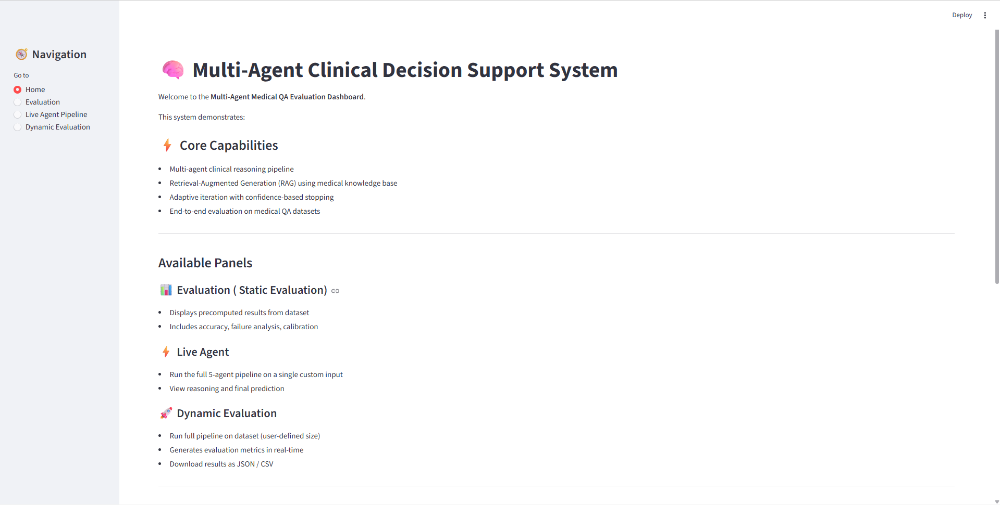
</p>
---

## 🎯 Project Objectives

This project aims to:

- Develop a modular **multi-agent clinical reasoning framework** for medical question answering.
- Improve factual accuracy using **Retrieval-Augmented Generation (RAG)** with a semantic vector database.
- Enhance reasoning quality through **live medical evidence retrieval** from external sources.
- Implement **confidence-aware adaptive reasoning** for automatic refinement of uncertain predictions.
- Provide transparent and explainable clinical reasoning with detailed agent execution logs.
- Build an interactive evaluation platform supporting benchmark analysis, failure investigation, and runtime monitoring.
- Demonstrate an end-to-end deployment of an agentic AI application using modern open-source technologies.


# ✨ Key Features

## 🤖 Multi-Agent Clinical Reasoning

The system decomposes complex clinical reasoning into a sequence of five specialized AI agents orchestrated using **CrewAI**. Each agent performs a dedicated task—including clinical information extraction, semantic retrieval, evidence gathering, reasoning synthesis, and adaptive optimization—resulting in a modular, transparent, and interpretable decision-making pipeline.

---

## 📚 Dual-Source Retrieval-Augmented Generation (RAG)

Unlike conventional RAG systems that rely solely on a vector database, this project combines **semantic retrieval from Qdrant Cloud** with **real-time web evidence retrieval** through the Serper API.

This hybrid retrieval strategy enables the system to:

- Retrieve verified medical knowledge from a curated vector database.
- Supplement responses with recent clinical evidence and guidelines.
- Reduce hallucinations through evidence-grounded reasoning.
- Improve performance on uncommon or evolving clinical scenarios.

---

## 🧠 Confidence-Gated Adaptive Reasoning

Every prediction generated by the Fusion Agent is accompanied by a confidence score.

Instead of immediately accepting uncertain predictions, the framework evaluates the confidence level and automatically invokes an **Adaptive Query Optimizer** whenever the confidence falls below the predefined threshold.

The optimizer:

- Re-evaluates the clinical scenario.
- Refines reasoning strategies.
- Performs additional reasoning iterations.
- Stops automatically once sufficient confidence is achieved or the maximum iteration limit is reached.

This adaptive workflow improves reliability while avoiding unnecessary computation for high-confidence cases.

---

## 🩺 Explainable Clinical Decision Making

Rather than generating only a final answer, the system produces a structured clinical explanation consisting of:

- Key clinical clues
- Clinical interpretation
- Differential reasoning
- Option elimination
- Core clinical concept
- Edge-case considerations
- Confidence estimation

This transparent reasoning process allows users to understand **how** each prediction was produced instead of treating the model as a black box.

---

## 🔍 Complete Agent Observability

Every execution is fully traceable through detailed agent logs.

The system records:

- Agent execution order
- Tool invocations
- Intermediate outputs
- Execution timestamps
- Reasoning iterations

This observability significantly simplifies debugging, evaluation, and failure analysis while improving trust in the reasoning pipeline.

---

## 📊 Comprehensive Evaluation Framework

The project includes an interactive evaluation platform built with **Streamlit**, supporting both benchmark analysis and live experimentation.

### Static Evaluation

Analyze pre-computed benchmark results through interactive dashboards featuring:

- Overall accuracy
- Category-wise performance
- Confidence calibration
- Failure distribution
- Iteration statistics
- Case Explorer
- Runtime analytics

### Dynamic Evaluation

Execute the complete multi-agent pipeline on configurable batches of MedQA questions and automatically generate:

- Live evaluation metrics
- Performance summaries
- Failure reports
- Downloadable CSV and JSON outputs

---

## 🌐 Interactive Web Application

The platform provides an intuitive Streamlit interface where users can:

- Submit custom clinical questions.
- Execute the complete reasoning pipeline.
- Inspect agent execution logs.
- Review structured clinical explanations.
- Explore evaluation dashboards.
- Compare benchmark performance across multiple clinical categories.

---

## ⚡ Modular Backend Architecture

The backend is implemented using **FastAPI**, exposing RESTful APIs for:

- Single-case inference
- Batch evaluation
- Runtime communication between the frontend and multi-agent pipeline

This modular architecture allows independent development and deployment of frontend and backend components.

---

## ☁️ Cloud-Ready Deployment

The complete application is deployed using **Render Cloud**, demonstrating an end-to-end production workflow consisting of:

- FastAPI backend services
- Streamlit frontend
- Qdrant Cloud vector database
- OpenRouter LLM gateway
- External medical evidence retrieval
- GitHub version control

The deployment architecture closely resembles modern production AI systems built around agent orchestration and API-driven microservices.

---

## 🧩 Extensible Design

The system is intentionally designed with modularity in mind, making it straightforward to:

- Replace individual LLMs.
- Add new reasoning agents.
- Integrate additional retrieval sources.
- Expand the medical knowledge base.
- Support multimodal clinical inputs.
- Incorporate new evaluation metrics.

This extensibility enables the framework to evolve beyond medical question answering into broader agentic AI applications.


# 🏗️ System Architecture

The Adaptive Multi-Agent Clinical Reasoning System is designed as a modular, layered architecture that separates user interaction, API services, agent orchestration, knowledge retrieval, and Large Language Model (LLM) inference. Each layer has a clearly defined responsibility, allowing the system to remain scalable, maintainable, and easily extensible.

Unlike conventional chatbot architectures where a single LLM directly generates responses, this framework follows an **Agentic AI** approach in which multiple specialized agents collaborate sequentially to solve complex clinical reasoning tasks.

---

## System Architecture Diagram

<p align="center">
  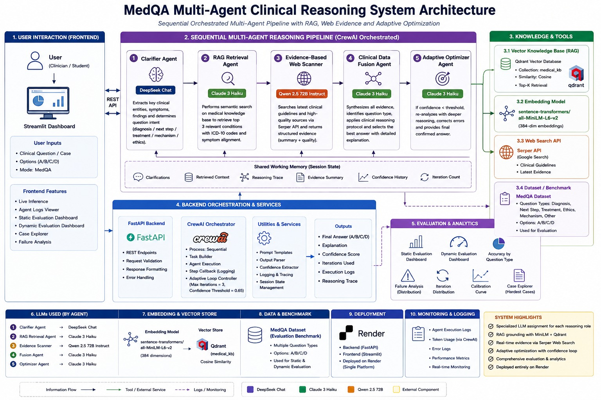
</p>

---

## Architecture Layers

The system is organized into five major layers that work together to transform a clinical question into an evidence-grounded, explainable medical decision.

### 1. Presentation Layer

The Presentation Layer provides an intuitive web interface built with **Streamlit**, allowing users to interact with the system without directly accessing backend services.

The interface consists of four major modules:

- Home Dashboard
- Static Evaluation Dashboard
- Live Agent Pipeline
- Dynamic Evaluation Dashboard

Users can submit clinical questions, monitor agent execution, inspect reasoning logs, evaluate benchmark performance, and export generated reports.

---

### 2. API Layer

The API Layer is implemented using **FastAPI** and serves as the communication bridge between the frontend and the agentic reasoning pipeline.

Its responsibilities include:

- Receiving inference requests
- Managing evaluation jobs
- Validating request data
- Invoking CrewAI workflows
- Returning structured JSON responses
- Supporting asynchronous execution

This separation ensures that frontend and backend components remain loosely coupled and independently deployable.

---

### 3. Multi-Agent Orchestration Layer

The core intelligence of the system resides in the CrewAI orchestration layer.

Instead of assigning every task to a single language model, the framework distributes responsibilities across five specialized AI agents.

The orchestration pipeline follows the sequence:

```
Clinical Question
        │
        ▼
Clinical Text Clarifier
        │
        ▼
Symptom RAG Analyzer
        │
        ▼
Evidence-Based Web Scanner
        │
        ▼
Clinical Data Fusion Agent
        │
        ▼
Confidence Evaluation
        │
   ┌────┴────┐
   │         │
   ▼         ▼
Answer   Adaptive Optimizer
              │
              ▼
      Additional Reasoning Cycle
```

Each agent receives the output of the previous agent as contextual input, enabling progressive refinement of clinical understanding throughout the reasoning process.

---

### 4. Knowledge & Retrieval Layer

The retrieval layer provides factual grounding for the reasoning pipeline.

Rather than depending entirely on parametric knowledge stored inside an LLM, the system retrieves information from two complementary sources.

#### Semantic Vector Retrieval

Medical documents are embedded using **SentenceTransformers (all-MiniLM-L6-v2)** and stored inside **Qdrant Cloud**.

For every clinical case, semantic similarity search retrieves the most relevant medical passages, ensuring that reasoning is grounded in domain-specific knowledge.

---

#### Live Evidence Retrieval

To complement static medical knowledge, the system performs real-time evidence retrieval using the **Serper API**.

This enables the framework to access:

- Recent clinical recommendations
- Medical guidelines
- Current web resources
- Additional supporting evidence

Combining static vector retrieval with dynamic web search significantly improves robustness when handling rare or evolving clinical scenarios.

---

### 5. LLM Inference Layer

Reasoning is powered through **OpenRouter**, which provides access to multiple Large Language Models.

Different models are assigned to specialized agents based on their reasoning requirements.

The current implementation utilizes:

- DeepSeek Chat
- Claude 3 Haiku
- Qwen 2.5-72B

By assigning models according to task specialization, the framework balances reasoning quality, latency, and computational cost.

---

## End-to-End Information Flow

The complete execution pipeline follows these stages:

1. The user submits a clinical question through the Streamlit interface.
2. FastAPI receives the request and forwards it to the CrewAI orchestrator.
3. The Clinical Text Clarifier extracts structured patient information.
4. The Symptom RAG Analyzer retrieves relevant medical knowledge from Qdrant.
5. The Evidence-Based Web Scanner collects supporting clinical evidence from the web.
6. The Clinical Data Fusion Agent combines all available information and generates a structured clinical decision.
7. The confidence score is evaluated.
8. If confidence is below the predefined threshold, the Adaptive Optimizer refines the reasoning and initiates another reasoning cycle.
9. The final prediction, explanation, confidence score, and execution logs are returned to the frontend.
10. Streamlit presents the complete reasoning workflow, visualizations, and evaluation metrics to the user.

---

## Architectural Advantages

The layered architecture provides several practical benefits:

- Modular separation of frontend, backend, retrieval, orchestration, and inference components.
- Specialized AI agents with clearly defined responsibilities.
- Transparent and explainable reasoning through sequential execution.
- Easy integration of additional agents, tools, or retrieval mechanisms.
- Independent scalability of API services and user interface.
- Improved maintainability through loosely coupled system components.
- Cloud-ready deployment suitable for modern agentic AI applications.

The result is a scalable, explainable, and production-oriented architecture capable of supporting complex clinical reasoning workflows while remaining flexible enough for future extensions and research.


# 🤖 Multi-Agent Pipeline

The core intelligence of the system lies in its **five-agent collaborative reasoning pipeline**, orchestrated using **CrewAI**. Instead of asking a single Large Language Model (LLM) to solve an entire medical case, the framework decomposes the reasoning process into a sequence of specialized agents, each responsible for a specific stage of clinical decision-making.

This modular design closely resembles how healthcare professionals approach complex cases—first understanding the patient's condition, then consulting medical knowledge, gathering supporting evidence, synthesizing all available information, and finally validating the diagnosis before making a decision.

The agents execute sequentially, with each agent receiving the outputs of all preceding agents as contextual input. This progressive refinement allows the system to build increasingly informed reasoning throughout the pipeline.

---

## Pipeline Workflow

<p align="center">
  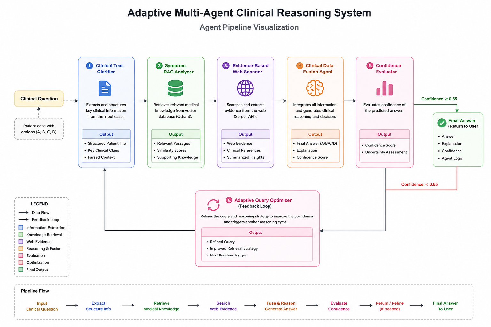
</p>

---

## Agent 1 — Clinical Text Clarifier

The Clinical Text Clarifier is responsible for transforming an unstructured clinical vignette into a structured representation that downstream agents can easily interpret.

Clinical cases often contain lengthy narratives describing symptoms, patient history, laboratory values, demographics, medications, and contextual information. Rather than forcing every downstream agent to repeatedly interpret this raw text, the Clarifier extracts the clinically significant information into a structured format.

### Responsibilities

- Extract patient demographics.
- Identify presenting symptoms.
- Parse laboratory findings.
- Detect relevant medical history.
- Identify the clinical question type.
- Organize extracted information into structured JSON.

### Input

- Clinical vignette
- Multiple-choice options

### Output

- Structured patient information
- Clinical clue summary
- Parsed reasoning context

---

## Agent 2 — Symptom RAG Analyzer

After the patient's clinical information has been structured, the Symptom RAG Analyzer retrieves supporting medical knowledge from the project's vector database.

Instead of relying solely on the LLM's internal knowledge, this agent performs semantic similarity search using embeddings generated by **SentenceTransformers (all-MiniLM-L6-v2)** against a **Qdrant Cloud** vector database.

This ensures that downstream reasoning remains grounded in relevant medical knowledge.

### Responsibilities

- Generate semantic embeddings.
- Query the Qdrant vector database.
- Retrieve the Top-K most relevant passages.
- Validate retrieval quality.
- Perform fallback retrieval when similarity is low.

### Input

- Structured clinical information

### Output

- Retrieved medical knowledge
- Similarity scores
- Supporting clinical passages

---

## Agent 3 — Evidence-Based Web Scanner

While vector databases provide curated medical knowledge, they cannot always capture newly published clinical recommendations or evolving medical evidence.

The Evidence-Based Web Scanner complements the RAG pipeline by retrieving real-time supporting evidence from external sources using the **Serper Search API**.

This dual-source retrieval strategy improves robustness and allows the system to incorporate recent medical information alongside its internal knowledge base.

### Responsibilities

- Generate clinical search queries.
- Retrieve relevant web evidence.
- Filter useful search results.
- Summarize supporting evidence.
- Provide additional reasoning context.

### Input

- Structured patient information
- Clinical reasoning context

### Output

- Supporting web evidence
- Clinical references
- Search summaries

---

## Agent 4 — Clinical Data Fusion Agent

The Clinical Data Fusion Agent serves as the primary reasoning component of the entire system.

It combines information generated by previous agents—including structured patient information, retrieved medical knowledge, and web evidence—to produce a comprehensive clinical decision.

Rather than generating only a final answer, the Fusion Agent follows a structured reasoning process that mirrors clinical problem-solving.

### Responsibilities

- Interpret the patient's condition.
- Combine multiple knowledge sources.
- Perform differential diagnosis.
- Eliminate incorrect options.
- Generate the final clinical answer.
- Estimate prediction confidence.

### Structured Reasoning Output

- Key Clinical Clues
- Clinical Interpretation
- Differential Diagnosis
- Option Elimination
- Core Clinical Concept
- Edge Case Analysis
- Final Answer
- Confidence Score

---

## Agent 5 — Adaptive Query Optimizer

The Adaptive Query Optimizer is invoked only when the Fusion Agent produces a low-confidence prediction.

Rather than immediately accepting uncertain outputs, the optimizer attempts to improve reasoning quality by reformulating the clinical problem and initiating another reasoning cycle.

This adaptive refinement mechanism enables the system to revisit difficult cases while avoiding unnecessary computation for high-confidence predictions.

### Responsibilities

- Evaluate prediction confidence.
- Reformulate uncertain reasoning.
- Refine retrieval strategy.
- Trigger another reasoning iteration.
- Stop after reaching the confidence threshold or maximum iteration limit.

### Trigger Condition

```text
Confidence < 0.65
```

### Maximum Iterations

```text
3
```

---

# Shared Context Between Agents

One of the key design principles of the pipeline is progressive context accumulation.

Rather than operating independently, every agent receives the outputs generated by all preceding agents. This creates a shared reasoning context that grows throughout execution, allowing later agents to make more informed decisions without repeating previous work.

The accumulated context typically includes:

- Structured patient information
- Retrieved medical passages
- Supporting web evidence
- Intermediate reasoning summaries
- Confidence estimates

This collaborative workflow enables the system to maintain continuity across the entire reasoning process while preserving clear separation of responsibilities between agents.

---

# Final Output

After completing the reasoning pipeline, the system returns a comprehensive response containing:

- Final predicted answer
- Prediction confidence
- Structured clinical explanation
- Agent execution logs
- Number of reasoning iterations
- Response latency
- Retrieved medical evidence
- Supporting web references

Instead of producing only a prediction, the framework provides complete transparency into **how** the decision was reached, making the reasoning process explainable, auditable, and significantly easier to evaluate and debug.

---
# 📊 Dashboard & User Interface

The project includes a comprehensive **Streamlit-based dashboard** that enables users to interact with the complete multi-agent reasoning pipeline, evaluate benchmark datasets, and analyze model performance through interactive visualizations.

The dashboard is divided into four major modules, each serving a specific purpose in the evaluation workflow.

---

## 🏠 Home Dashboard

The Home page serves as the landing page of the application, providing a quick overview of the system, its capabilities, available modules, and the complete reasoning pipeline.

It introduces users to the overall workflow before they begin evaluating clinical cases or interacting with the live multi-agent system.

<p align="center">
  
</p>

---

## 📈 Static Evaluation Dashboard

The Static Evaluation module displays precomputed evaluation results generated using the MedQA benchmark dataset. It allows users to analyze system performance without executing the pipeline again.

### Overview

Provides a high-level summary of evaluation metrics including:

- Overall Accuracy
- Failure Rate
- Average Execution Time
- Average Iterations
- Summary Insights

<p align="center">
  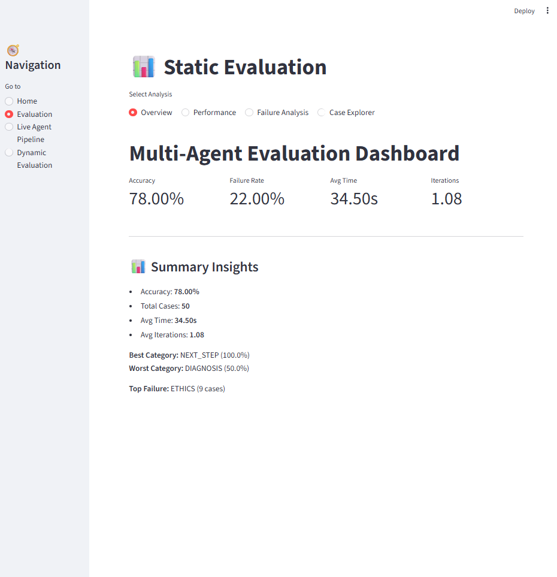
</p>

### Performance Analysis

Visualizes important performance metrics such as:

- Accuracy by Question Type
- Iteration Distribution
- Confidence Calibration Curve

<p align="center">
  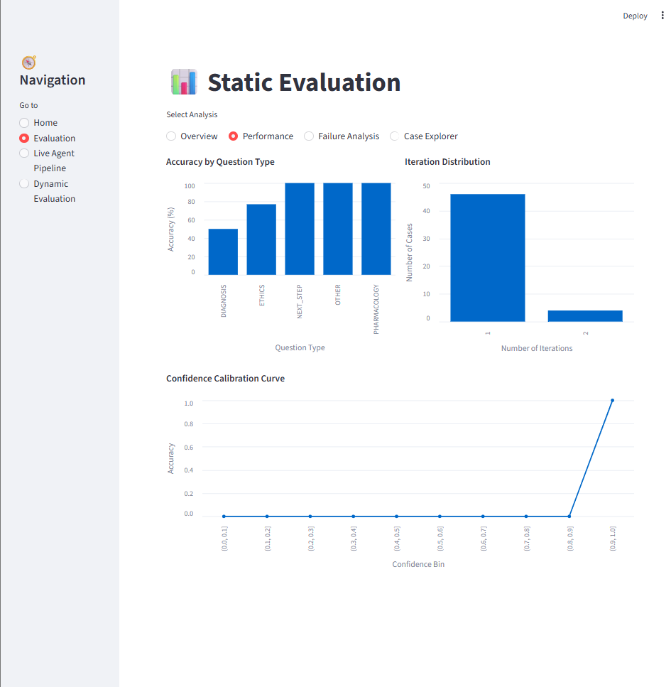
</p>

### Failure Analysis

Identifies failure patterns across different clinical question categories.

<p align="center">
  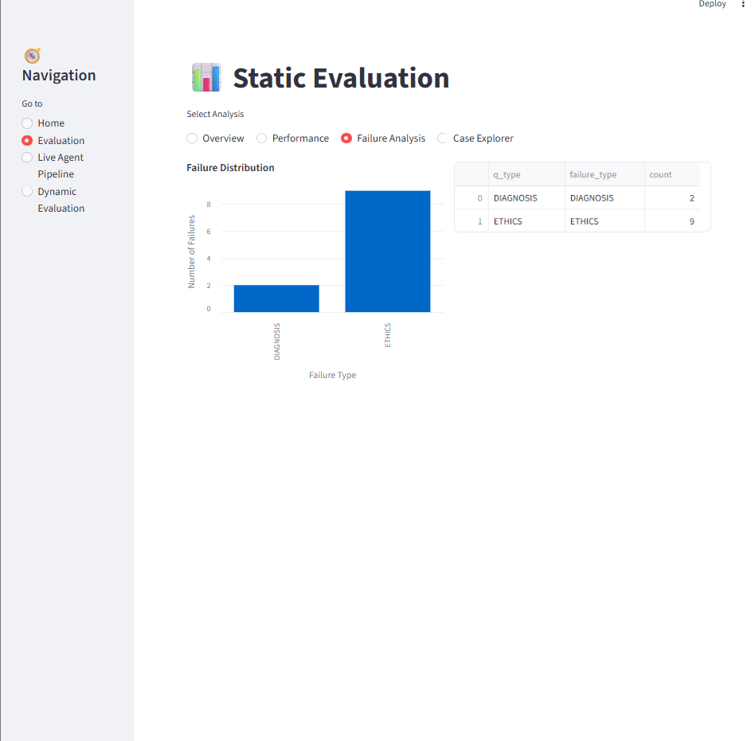
</p>

### Case Explorer

Allows users to inspect every evaluated case individually, including:

- Ground Truth
- Predicted Answer
- Confidence Score
- Execution Time
- Number of Iterations
- Failure Type

<p align="center">
  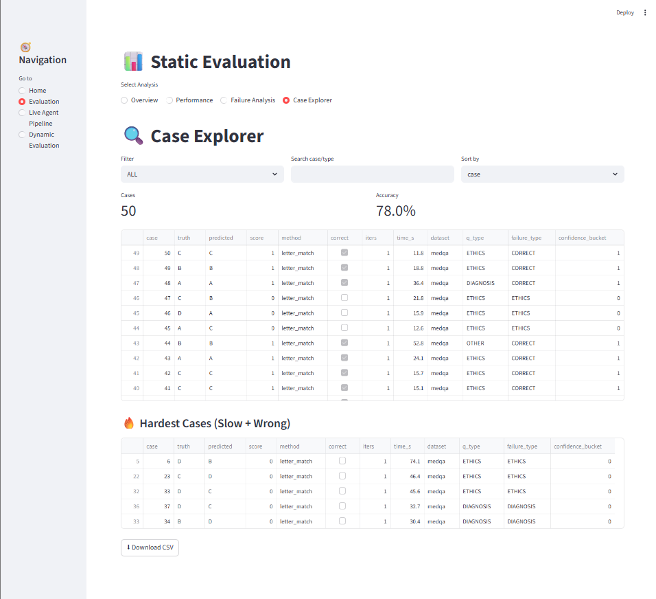
</p>

---

## ⚡ Live Multi-Agent Pipeline

The Live Pipeline demonstrates the complete reasoning workflow on a custom clinical question entered by the user.

Users can observe how all five specialized agents collaborate sequentially to generate the final clinical decision.

### Custom Clinical Input

Users can enter:

- Clinical Question
- Multiple Choice Options

and execute the complete CrewAI pipeline.

<p align="center">
  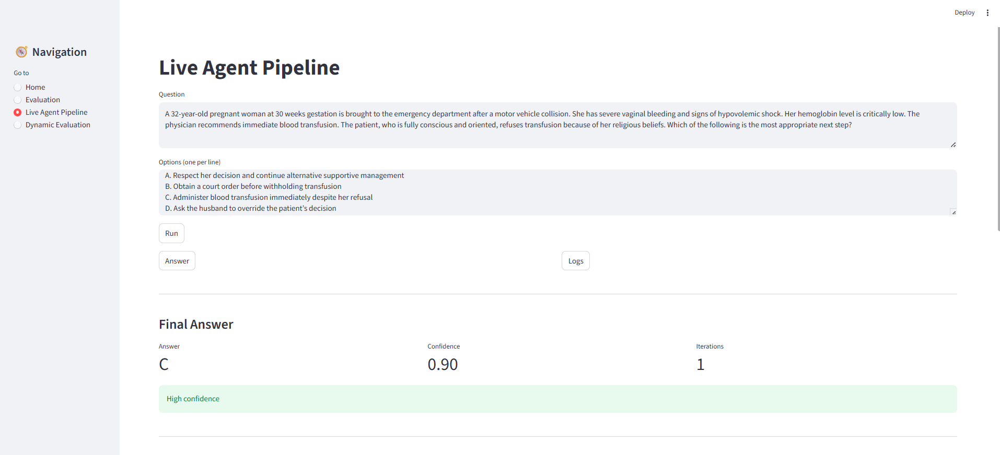
</p>

### Agent Execution Logs

Displays real-time execution logs produced by each reasoning agent, making the decision-making process transparent and explainable.

<p align="center">
  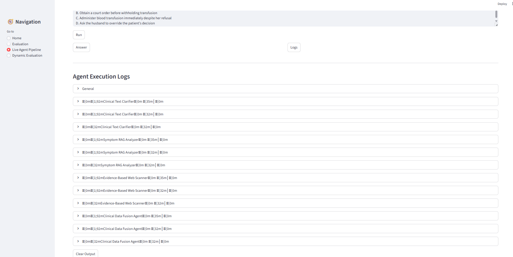
</p>

### Final Clinical Decision

After pipeline execution, the dashboard presents:

- Predicted Answer
- Confidence Score
- Number of Iterations
- Detailed Clinical Explanation
- Supporting Reasoning

<p align="center">
  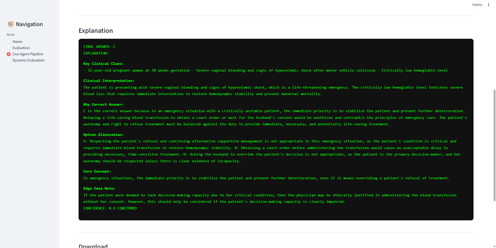
</p>

---

## 🚀 Dynamic Evaluation Dashboard

Unlike Static Evaluation, this module executes the complete multi-agent pipeline on a user-defined number of benchmark cases and generates evaluation metrics in real time.

### Overview

Displays overall evaluation statistics generated after execution.

<p align="center">
  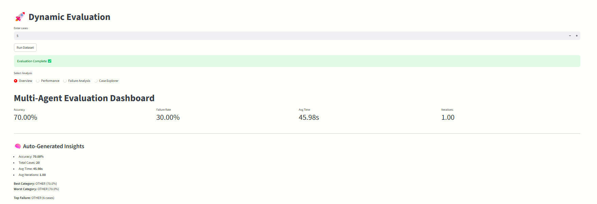
</p>

### Performance Analysis

Provides dynamic performance visualizations including:

- Accuracy by Question Type
- Iteration Distribution
- Confidence Calibration Curve

<p align="center">
  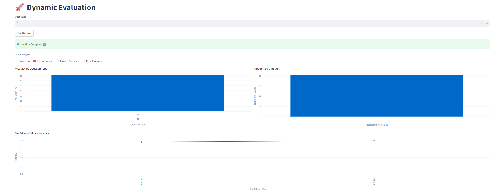
</p>

### Failure Analysis

Analyzes incorrect predictions and their corresponding failure categories.

<p align="center">
  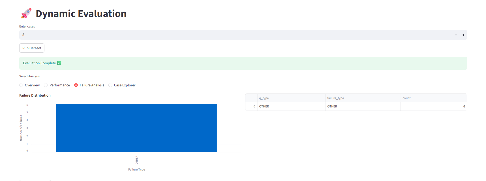
</p>

### Case Explorer

Allows detailed inspection of every dynamically evaluated clinical case.

<p align="center">
  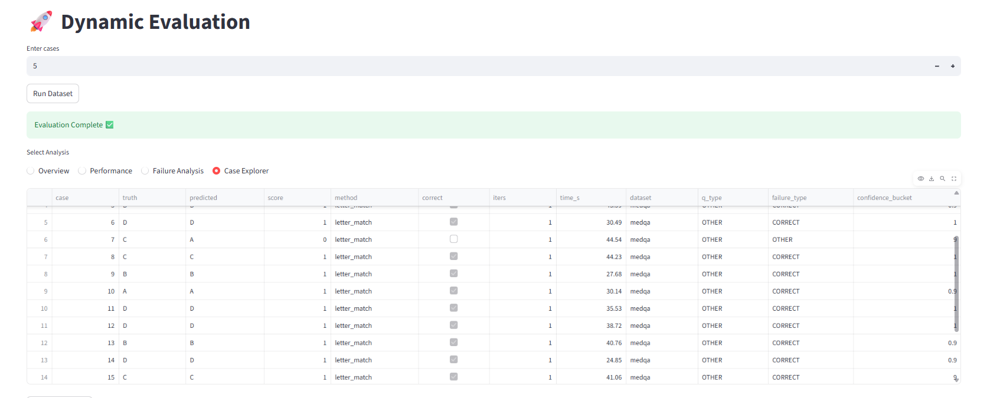
</p>

---

### ✨ Dashboard Highlights

- Interactive Streamlit interface
- Live execution of the complete multi-agent pipeline
- Static benchmark evaluation
- Dynamic dataset evaluation
- Real-time execution logs
- Confidence estimation
- Explainable clinical reasoning
- Failure analysis dashboard
- Case-level exploration
- Downloadable evaluation results


---

# 🛠️ Technology Stack

| Category | Technologies |
|-----------|--------------|
| **Programming Language** | Python |
| **Agent Framework** | CrewAI |
| **Backend** | FastAPI, Uvicorn |
| **Frontend** | Streamlit |
| **LLM Gateway** | OpenRouter |
| **Language Models** | DeepSeek Chat, Claude 3 Haiku, Qwen 2.5-72B |
| **Vector Database** | Qdrant Cloud |
| **Embedding Model** | SentenceTransformers (all-MiniLM-L6-v2) |
| **Web Search** | Serper API |
| **Data Processing** | Pandas, NumPy |
| **Visualization** | Altair |
| **Deployment** | Render Cloud |
| **Version Control** | Git & GitHub |
---
# 📁 Project Structure

```text
medrag-multiagent-eval/
│
├── backend/
│   ├── pipeline/
│   │   ├── __init__.py
│   │   ├── agents.py              # CrewAI agent definitions
│   │   ├── dataset_loader.py      # MedQA dataset loader
│   │   ├── evaluator.py           # Evaluation metrics & analysis
│   │   ├── llm_config.py          # LLM configuration
│   │   ├── orchestrator.py        # Multi-agent orchestration
│   │   ├── parser.py              # Output parsing utilities
│   │   ├── rag.py                 # Qdrant retrieval pipeline
│   │   ├── runner.py              # Pipeline execution
│   │   ├── setup_qdrant.py        # Vector database initialization
│   │   ├── tasks.py               # CrewAI task definitions
│   │   └── tools.py               # External tools & utilities
│   │
│   ├── .env                       # Environment variables (not included)
│   ├── main.py                    # FastAPI backend
│   ├── medqa_test.csv             # MedQA evaluation dataset
│   └── schemas.py                 # API schemas
│
├── frontend/
│   ├── app.py                     # Streamlit dashboard
│   ├── dashboard_medqa.csv        # Static evaluation results
│   └── dashboard_medqa.json
│
├── images/                        # README assets
│
├── .gitignore
├── README.md
├── render.yaml                    # Render deployment configuration
├── requirements.txt
├── runtime.txt
└── visualizer.html
```

### Directory Overview

| Directory | Purpose |
|-----------|---------|
| **backend/** | FastAPI backend and complete multi-agent reasoning pipeline |
| **backend/pipeline/** | CrewAI agents, orchestration, RAG, evaluation, utilities |
| **frontend/** | Streamlit-based interactive dashboard |
| **images/** | Architecture diagrams and README screenshots |
| **requirements.txt** | Python dependencies |
| **render.yaml** | Deployment configuration for Render |
| **visualizer.html** | Agent workflow visualization |

---
# ⚙️ Installation & Setup

Follow the steps below to set up the project locally.


## 1️⃣ Clone the Repository

```bash
git clone https://github.com/Lakshman2405/medrag-multiagent-eval.git
cd medrag-multiagent-eval
```

---

## 2️⃣ Create a Virtual Environment

### Windows

```bash
python -m venv venv
venv\Scripts\activate
```

### Linux / macOS

```bash
python3 -m venv venv
source venv/bin/activate
```

---

## 3️⃣ Install Dependencies

```bash
pip install -r requirements.txt
```

---

## 4️⃣ Configure Environment Variables

Create a `.env` file inside the **backend/** directory.

```text
DEEPSEEK_API_KEY=your_deepseek_api_key
ANTHROPIC_API_KEY=your_anthropic_api_key
QWEN_API_KEY=your_qwen_api_key
SERPER_API_KEY=your_serper_api_key
QDRANT_URL=your_qdrant_url
QDRANT_API_KEY=your_qdrant_api_key
```

> **Note:** API keys are required for LLM inference, web search, and vector database connectivity.

---

## 5️⃣ Build the Vector Database

Generate embeddings and populate the Qdrant knowledge base.

```bash
python backend/pipeline/setup_qdrant.py
```

This process:

- Creates the medical knowledge collection
- Generates sentence embeddings
- Stores vectors in Qdrant
- Prepares the RAG retrieval pipeline

---

## 6️⃣ Start the Backend

```bash
python backend/main.py
```

The FastAPI server will start locally.

---

## 7️⃣ Launch the Streamlit Dashboard

Open a new terminal and run:

```bash
streamlit run frontend/app.py
```

The dashboard will automatically open in your browser.

---

## 8️⃣ Verify Installation

If everything is configured correctly, you should be able to:

- ✅ Access the Streamlit Dashboard
- ✅ Run the Live Multi-Agent Pipeline
- ✅ View Agent Execution Logs
- ✅ Perform Static Evaluation
- ✅ Execute Dynamic Evaluation
- ✅ Retrieve medical knowledge using RAG
- ✅ Generate evidence-based clinical reasoning


# 🚀 Usage

The Streamlit dashboard consists of three primary modules.

---

## 🏠 Home

Provides an overview of the system, core capabilities, available modules, and the overall multi-agent workflow.

---

## 📊 Static Evaluation

Analyze precomputed MedQA benchmark results.

Features include:

- Overall performance dashboard
- Accuracy statistics
- Failure analysis
- Confidence calibration
- Iteration distribution
- Case explorer for individual predictions

---

## ⚡ Live Agent Pipeline

Run the complete five-agent reasoning pipeline on a custom clinical question.

Workflow:

1. Enter a clinical question
2. Provide answer options
3. Execute the pipeline
4. Monitor agent execution logs
5. Review the final prediction
6. Inspect the generated clinical explanation

---

## 🚀 Dynamic Evaluation

Execute the pipeline on a user-defined number of MedQA samples.

Features include:

- Real-time evaluation
- Accuracy metrics
- Failure analysis
- Performance visualization
- Case explorer
- CSV/JSON result export

---
# 📊 Evaluation Framework

To assess the effectiveness of the proposed multi-agent clinical reasoning system, the project incorporates a comprehensive evaluation framework that supports both **static benchmark analysis** and **dynamic real-time evaluation**. The framework is designed to measure not only prediction accuracy but also reasoning efficiency, confidence calibration, execution latency, and failure characteristics.

---

## Static Evaluation

Static Evaluation analyzes precomputed results generated using the **MedQA benchmark dataset**. It enables users to explore system performance without rerunning the inference pipeline.

The dashboard provides the following analyses:

- **Overview:** Overall accuracy, failure rate, average execution time, and average reasoning iterations.
- **Performance Analysis:** Accuracy by question category, confidence calibration, and iteration distribution.
- **Failure Analysis:** Distribution of incorrect predictions across different medical domains.
- **Case Explorer:** Interactive inspection of individual benchmark cases, including predictions, confidence scores, execution time, and reasoning statistics.

---

## Dynamic Evaluation

Dynamic Evaluation executes the complete multi-agent pipeline on a user-defined number of MedQA samples in real time.

Unlike Static Evaluation, all metrics are generated during execution, allowing users to benchmark the system under different workloads and observe its real-time performance.

Generated outputs include:

- Overall accuracy
- Average execution time
- Average reasoning iterations
- Category-wise performance
- Failure distribution
- Confidence calibration
- Downloadable JSON and CSV reports

---

## Evaluation Metrics

The framework evaluates system performance using multiple complementary metrics.

| Metric | Description |
|---------|-------------|
| **Accuracy** | Percentage of correctly predicted answers. |
| **Average Execution Time** | Mean inference time required to solve a clinical case. |
| **Average Iterations** | Average number of reasoning iterations performed before reaching a final decision. |
| **Accuracy by Question Type** | Performance across different MedQA categories. |
| **Confidence Calibration** | Relationship between model confidence and prediction correctness. |
| **Failure Distribution** | Categorization of incorrect predictions by question type. |
| **Iteration Distribution** | Frequency of adaptive reasoning iterations required across the evaluation dataset. |

---

## Benchmark Dataset

The evaluation pipeline uses the **MedQA benchmark**, a widely used medical multiple-choice question-answering dataset designed to assess clinical reasoning capabilities of AI systems.

Each evaluation case consists of:

- Clinical vignette
- Four answer options
- Ground-truth answer
- Question category

The framework automatically processes each case, executes the complete multi-agent reasoning pipeline, records execution statistics, and aggregates the results into an interactive dashboard.

---

## Evaluation Outputs

After every evaluation run, the system automatically generates:

- Interactive performance dashboards
- Case-level prediction summaries
- Failure analysis reports
- Confidence calibration statistics
- Downloadable CSV reports
- Downloadable JSON reports

These outputs enable detailed quantitative and qualitative analysis of the system's reasoning performance while providing complete transparency into its behavior across different clinical scenarios.

---

# 🎯 Live Pipeline Results

Once the multi-agent pipeline completes execution, the system generates a comprehensive clinical reasoning report instead of returning only a predicted option. Every stage of the reasoning process is exposed to the user, making the decision transparent, interpretable, and easy to validate.

The final output consists of four major components:

- **Predicted Answer** – The selected option for the clinical question.
- **Confidence Score** – Model confidence associated with the prediction.
- **Reasoning Iterations** – Number of reasoning cycles performed before reaching the final decision.
- **Structured Clinical Explanation** – A detailed justification describing how the final decision was derived.

<p align="center">
  
</p>

---

## Agent Execution Logs

In addition to the final prediction, the system records the execution trace of every agent participating in the reasoning pipeline.

The logs provide complete visibility into:

- Agent execution sequence
- Intermediate reasoning outputs
- Retrieved medical evidence
- Decision refinement steps
- Adaptive optimization iterations

This enables users to inspect the complete reasoning process rather than treating the system as a black-box model.

<p align="center">
  
</p>

---

## Downloadable Reports

For every execution, users can export the generated results for further analysis.

Available export formats include:

- JSON Result
- Agent Execution Logs
- Complete Execution Report

These reports simplify debugging, reproducibility, and offline analysis while supporting future benchmarking and research.

---

# 🚀 Future Improvements

While the current system demonstrates the effectiveness of a multi-agent approach for clinical question answering, several enhancements can further improve its reasoning capabilities, scalability, and real-world applicability.

## Planned Enhancements

- **Expanded Medical Knowledge Base**
  - Integrate larger and more diverse medical literature, clinical guidelines, and research publications to improve retrieval quality.

- **Hybrid Retrieval Pipeline**
  - Combine dense vector search with keyword-based retrieval and reranking techniques for improved context selection.

- **Support for Additional Medical Benchmarks**
  - Extend evaluation beyond MedQA to datasets such as PubMedQA, MedMCQA, MMLU-Medical, and other clinical reasoning benchmarks.

- **Advanced Evaluation Metrics**
  - Incorporate semantic similarity, answer faithfulness, reasoning consistency, and LLM-as-a-Judge evaluation for more comprehensive performance assessment.

- **Long-Term Memory**
  - Introduce persistent memory to support multi-turn clinical conversations and longitudinal patient interactions.

- **Multimodal Clinical Reasoning**
  - Expand the framework to process medical images, laboratory reports, ECGs, radiology findings, and other clinical modalities alongside textual information.

- **Human-in-the-Loop Validation**
  - Enable clinicians to review, verify, and provide feedback on generated reasoning to improve transparency and model reliability.

- **Containerized Deployment**
  - Package the application using Docker and orchestration platforms for easier deployment and scalability across different environments.


The modular architecture of the project enables these enhancements to be incorporated with minimal changes to the existing pipeline, making it a flexible foundation for future research and development in agentic clinical AI systems.

---

# 👥 Team Contributions

This project was developed as a collaborative effort, with each team member contributing to different aspects of the system, ranging from multi-agent pipeline development and backend implementation to evaluation framework design and frontend development.

| Team Member | Contributions |
|-------------|---------------|
| **Sikhakolli Lakshman Guru Sai** | Designed the overall system architecture, implemented the CrewAI multi-agent pipeline, integrated Large Language Models through OpenRouter, developed the FastAPI backend, implemented the Retrieval-Augmented Generation (RAG) workflow using Qdrant, configured external APIs, deployed the application on Render, and contributed to project integration and documentation. |
| **Dronadula Sree Sai** | Developed and refined the Retrieval-Augmented Generation pipeline, prepared and processed the medical knowledge base, contributed to prompt engineering, retrieval optimization, and dataset preparation for evaluation. |
| **Mothukuru Sreekar** | Designed and developed the Streamlit dashboard, implemented the static and dynamic evaluation framework, created interactive visualizations, developed performance analytics and case exploration modules, and contributed to testing and user interface improvements. |


## 🤝 Collaborative Contributions

Several components of the project were developed collaboratively by the entire team, including:

- Multi-agent workflow design and refinement.
- Prompt engineering and agent behavior optimization.
- System integration and end-to-end testing.
- Experimental evaluation and performance analysis.
- Presentation preparation and technical documentation.
- Repository maintenance and version control.

The successful completion of this project was the result of continuous collaboration, iterative development, and collective problem-solving throughout the design, implementation, evaluation, and deployment phases.

---

# 🙏 Acknowledgements

We would like to sincerely thank the open-source community and the researchers whose work made this project possible.

This project builds upon several outstanding frameworks, tools, APIs, and research contributions in the fields of Large Language Models, Retrieval-Augmented Generation, and Agentic AI.

Special thanks to the teams behind:

- **CrewAI** for providing the multi-agent orchestration framework.
- **FastAPI** for enabling high-performance backend development.
- **Streamlit** for simplifying interactive dashboard development.
- **Qdrant** for providing a scalable vector database for semantic retrieval.
- **SentenceTransformers** for efficient embedding generation.
- **OpenRouter** for unified access to multiple state-of-the-art Large Language Models.
- **Serper API** for enabling real-time web evidence retrieval.
- **MedQA** for providing a benchmark dataset for evaluating clinical reasoning systems.

We also acknowledge the broader open-source AI community for continuously advancing research in agentic AI, retrieval systems, and explainable language models. Their contributions have been invaluable in shaping this project.
---
# 📄 License

Copyright © 2026 Team MedRAG Multi-Agent Evaluation.

All rights reserved.

This repository and its contents are the intellectual property of the project authors. No part of this repository may be copied, modified, redistributed, or used for commercial or non-commercial purposes without prior written permission from the authors.

This repository is made publicly available solely for demonstration, academic review, and portfolio purposes.

> **Disclaimer:** This project is intended for research and educational demonstration only. It is not designed, validated, or certified for real-world clinical diagnosis, treatment planning, or medical decision-making.


